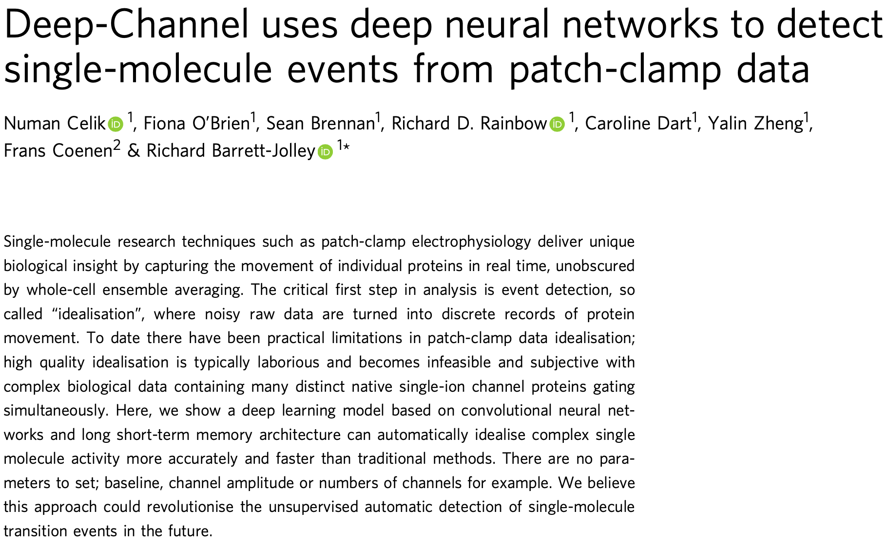

# Deep-Channel-Pytorch
Deep-Channel是利物浦大学Richard Barrett-Jolley等人开发的用于预测离子通道状态的模型（[原文戳这里！](https://www.nature.com/articles/s42003-019-0729-3)）（[源码戳这里！](https://github.com/RichardBJ/Deep-Channel))。作者在开发时以**TensorFlow**为基础，本文使用Pytorch对代码进行重现。

